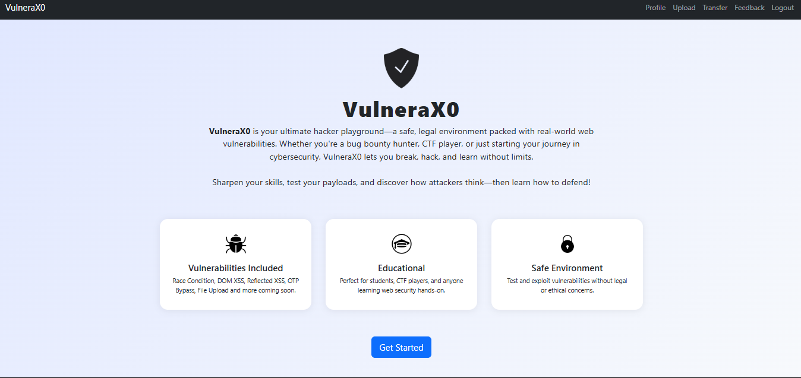

# 🔥 VulneraX0 – A Modern Vulnerable Web App Lab



**VulneraX0** is a modern, intentionally vulnerable web application designed for CTF players, cybersecurity learners, and ethical hackers to sharpen their skills on real-world web vulnerabilities — all in a secure and controlled environment.

> 🎯 *Break it to learn it. Practice advanced exploitation techniques like DOM-based XSS, Race Conditions, IDOR, and more.*


---

## 🚀 Quick Start (Docker)

```bash
docker pull tracex0/vulnerax0
docker run --add-host=host.docker.internal:host-gateway -p 5000:5000 tracex0/vulnerax0
```

🔗 Visit the lab: [http://localhost:5000](http://localhost:5000)

---

## 📧 MailHog Setup 

Some features use email workflows (e.g., OTP). To view these emails, run **MailHog** locally.

### 🖥️ For **Linux / macOS**

1. Download and run MailHog:

   ```bash
   wget https://github.com/mailhog/MailHog/releases/download/v1.0.1/MailHog_linux_amd64 -O MailHog
   chmod +x MailHog
   ./MailHog
   ```

---

### 🪟 For **Windows**

1. Download `MailHog.exe` from the official release page:  
   [https://github.com/mailhog/MailHog/releases](https://github.com/mailhog/MailHog/releases)

2. In a second terminal, run:

   ```bash
   MailHog.exe
   ```

---

### 🌐 Access MailHog Web UI

- Open your browser and visit:  
  [http://localhost:8025](http://localhost:8025)

> 🔐 MailHog captures OTP or email data sent by VulneraX0 so you can test your exploit flow.

---

## 👥 Default Credentials

```
admin / admin  
john  / john
```

---

## 🛠️ Included Vulnerabilities

| 🔐 Vulnerability Type                   | 📌 Description                                                                |
| --------------------------------------- | ------------------------------------------------------------------------------ |
| Reflected XSS                           | Exploit reflected user input to trigger script execution.                      |
| DOM-based XSS                           | Classic payloads are blocked. Only advanced ones work.                         |
| Race Condition                          | Abuse timing flaws to manipulate logic or cause inconsistencies.               |
| OTP Bypass / Bruteforce                 | Brute-force OTP due to lack of rate limiting or protection.                    |
| IDOR (Insecure Direct Object Reference) | Access unauthorized data by modifying object identifiers.                      |
| File Upload → RCE                       | Exploit insecure file upload to gain remote code execution.                    |

---

## 🏁 Flags

- 🧠 **DOM-based XSS**: Successful exploitation using advanced payloads will expose a hidden flag in the browser(use webhook or Burp collaborater to fetch flag).
- 💣 **File Upload → RCE**: Exploiting the file upload mechanism to achieve remote code execution will reveal a flag stored on the server.

Flags are only revealed after successful exploitation and are hidden from direct access. Use your skills to find and capture them!

---

## 🧰 Tools & Wordlists

- [`vulnerax0-fuzz.txt`](./vulnerax0-fuzz.txt): Useful payloads for quick fuzzing & testing input vectors.

---

## 📚 Writeups & Exploits

Solutions, payload crafting, and walkthroughs will be published here:

- 📝 Medium: [https://medium.com/@TraceX0](https://medium.com/@TraceX0)  
- 📺 YouTube: [https://www.youtube.com/@TraceX0-0](https://www.youtube.com/@TraceX0-0)

---

## 🧠 Coming Soon

More modern and complex vulnerabilities will be added soon:

- Cache Poisoning/Deception
- Server-Side Request Forgery (SSRF)
- JWT-based modern auth attacks
- Dependency Confusion Attacks
- Advanced XSS payload bypasses
- And many more…

---

## 🛡️ Disclaimer

This project is for **educational purposes only**.  
Do **not** deploy this application in a production environment.  
All vulnerabilities are intentional and meant for safe security practice.

---

## 🙌 Credits

Built with ❤️ by **TraceX0**  

---

**Happy Hacking!** 🕵️‍♂️  
*Hack smart. Break quiet. Ship loud.*
